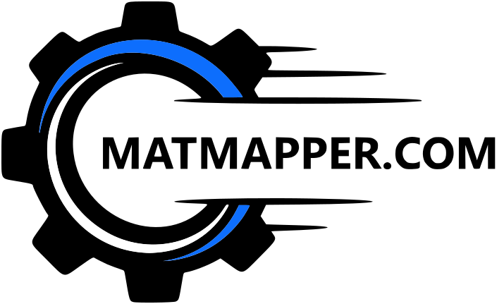
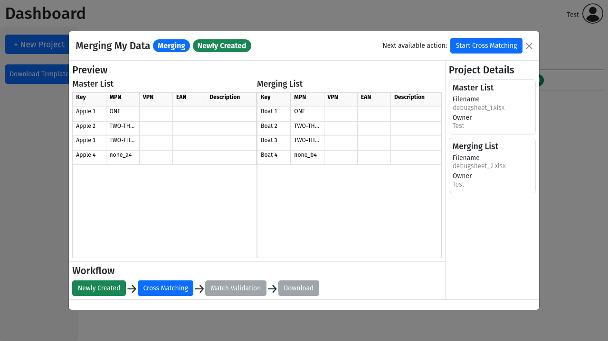
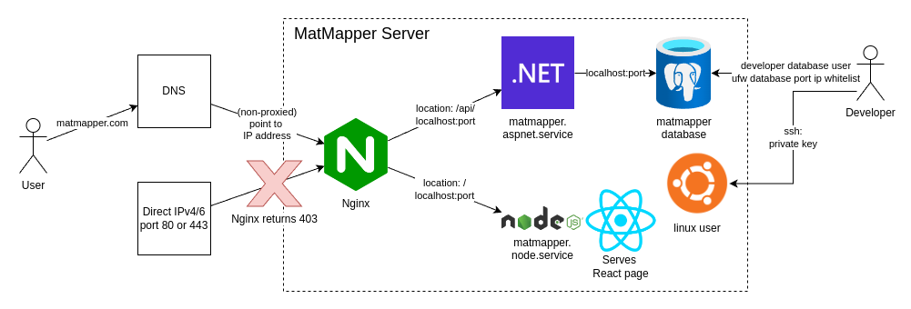

 

  

<h3 align="center">MatMapper Documentation</h3>

## Intro

The MatMapper project is a web application system that allows users to merge and 
deduplicate materials data spreadsheets.

Currently accessible on the temporary domain [shibaholic.dev](shibaholic.dev). 
But requires a registration token to set up a user.

This application is bespoke-ly designed to process materials data. 
Materials data is an especially difficult type of data to keep clean as it:

1. Has no standardized formats used between different firms.
2. Firms often use large quantities of different materials data.
3. Easy to confuse similar sounding materials.
4. Difficult to check for errors as not all vendors' materials data is easily available.
5. It is difficult to govern the data of a firm with multiple departments entering new data into the system.

This project attempts to solve this by allowing users to better merge new data and 
deduplicate their existing data.

## How do you use it

Firstly, currently only invited users are able to use the application, 
which is controlled by only allowing users with a unique registration token to register a user account.

In the dashboard, users create a new project by choosing a task and 
uploading their spreadsheet files.

The `Merging Task` is for merging 1 list of new data into 1 list of master data.

The `Deduplication Task` is for deduplicating 1 list of data.

Once successfully uploaded, users click on the project which opens the project modal. 
This shows a preview of their uploaded data and some details.

Next, the user clicks on `Start Cross Matching` in the top-right corner to make the server 
perform cross-column matching in order to find entries that may in fact be the same between 
the 2 lists.

Once cross-column matching has finished, the server updates the project state to `Cross Matching Completed`.

Clicking on `Start Match Validation` opens the validation page.

Here users will perform manual validation of every match that occured. 
Each row shows the two entries that matched to each other, 
showing which columns matched and what their values are. 
The user can press the buttons on the screen or use keybindings to mark each match as `validated`,
`for later inspection` or `discard`.

Finally, the user can export their desired match validation type as a spreadsheet containing the keys. 
It is the user's responsibility to use the exported keys to clean their own data themselves, as
MatMapper ultimately does not clean their data (which would usually be inside an ERP system).

## Technology and design overview

The project is separated into 3 main parts. The frontend, backend API and database.

- Frontend: React TypeScript.
- Backend API: C# ASP.NET.
- Database: PostgreSQL.

|  | 
|:----------------------------------------------------:| 
|                *High Level Overview*                 |

### Frontend

The main technologies used in the frontend user interface are React and TypeScript. As well as Vite for fast HMR.

#### Packages used

- React Bootstrap
- react-router
- react-window
- react-data-grid
- SignalR Javascript client
- diff

#### Features

- Client-side authorization using react-router.
- JWT access token stored in memory and JWT refresh token stored in cookies.
- Receives server-sent events using SignalR.
- Infinite scrolling lists.
- Keybindings for match validation step.
- File downloads.

### Backend API

The main technologies used in the backend API are C# and .NET'S ASP.NET.

The backend API is designed following the Clean Architecture.

#### Packages used

Packages for each layer include:
1. Presentation
   - JwtBearer
   - Swagger
   - SignalR server
2. Application
   - Mediatr
   - ClosedXML
   - BCrypt
   - AutoMapper
3. Domain (no packages)
4. Infrastructure
   - EF Core
   - Npgsql

The package used for unit testing was XUnit.

#### Features

- Server-sent events using SignalR.
- JWT endpoint authorization and authentication.
- Mediator pattern application layer using Mediatr.
- BackgroundService for long-running processes such as [cross-column matching algorithms](/api/CrossColumnMatchingOptimization.md).
- Bulk insert and bulk read implemented using PostgreSQL COPY command using Npgsql.
- File download endpoints.
- ...

## Deployment

There is currently an issue with the domain name provider that is 
preventing utilization of the `matmapper.com` domain.

Instead, the temporary domain [shibaholic.dev](shibaholic.dev) is being 
hosted with Cloudflare, which was easy to set up (HTTPS, firewalls).

The application is currently being hosted on a Hetzner Cloud instance 
running Ubuntu.

2 bash scripts were written to build and deploy both the frontend and 
backend API services. These scripts first build the programs for the 
production environment, then compress them, send them to the server using SCP,
SSH into the server, stop the systemd service, delete old files, 
unpack new files and restart the systemd service.

That is just a simple way of deploying the project. Since this is a relatively simple
project, rollback, continuous delivery are not implemented.

Database migrations are performed manually using `dotnet ef migrations`.

## Other documents

- [Optimization of Cross-Column Matching Algorithm](api/CrossColumnMatchingOptimization.md)
- [Short Writeup of Npgsql Binary COPY](database/BinaryCopy.md)
- [Problems I was stuck on, but have now learned](LessonsLearned.md)