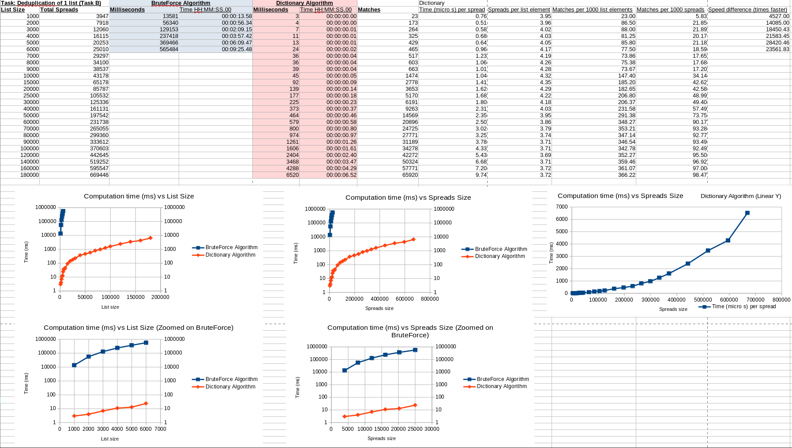

[Back to root](../README.md)

# Optimization of Cross Column Matching Algorithm

Only the deduplication algorithm will be described here for brevity. 
But the two algorithms are very similar.

See the bottom for the algorithm benchmarks and skip the explanation of the problem and implementation.

## Problem

How can we find all matches from checking if every row's columns' value is equal to every other row's columns' value?

### Example

Not full data model.

### Input

| Key | Mpn             | Vpn             |
|-----|-----------------|-----------------|
| 1   | ONE_TWO         |                 |
| 2   | ONE_TWO         |                 |
| 3   |                 | THREE_FOUR_FIVE |
| 4   | THREE_FOUR_FIVE |                 |
| 5   | THREE_FOUR_FIVE |                 | 
| 6   | SIX_EIGHT       |                 |
| 7   |                 | SEVEN_EIGHT     |
| 8   | SIX_EIGHT       | SEVEN_EIGHT     |

#### Output

Key pairs that have equal values.

| Key1 | Key2 |
|------|------|
| 1    | 2    |
| 3    | 4    |
| 3    | 5    |
| 4    | 5    |
| 6    | 7    |
| 6    | 8    |
| 7    | 8    |

## Solutions

### Common part: creating a list of spreads

The first step involves "spreading" the columns into their own list, only taking non-nulls and other filters to limit computation size.

What is returned is a list of Spreads.

```csharp
// NOTE: this is very simplified
class MaterialRow {
    public int Key { get; set; }
    public string Mpn { get; set; }
    public string Vpn { get; set; }
}

class Spread {
    public int Key { get; set; }
    public string Value { get; set; }
    public string ColType { get; set; }
}

List<MaterialRow> materialRows = getMaterialRows();

List<Spread> spreads = generateSpreads(materialRows);
```

### Brute Force Algorithm

The Brute Force Algorithm simply loops through every Spread,
and then loops over every other Spread (we shouldn't compare columns from the same row) to see if it matches.

Then it performs a match check, and adds it to a `List<Match> matches` if successful.

```csharp
List<Match> matches = new List<Match>();

for (int spread_index = 0; spread_index < spreads.Count; spread_index++)
{
    
    var c_spread = spreads[spread_index];
    if (c_spread.RowId == maxRowId)
    {
        break;
    }
    // look forward to find the first spread where it is different to current spread
    int rowId_edge = spreads.Count; // default value if nothing is found....
    for (int forward_index = spread_index; forward_index < spreads.Count; forward_index++)
    {
        if (c_spread.RowId == spreads[forward_index].RowId)
        {
            continue;
        }
        rowId_edge = forward_index;
        
        break;
    }
    
    // now match spread_index to rowId_edge and onwards.
    for (int other_index = rowId_edge; other_index < spreads.Count; other_index++)
    {
        var o_spread = spreads[other_index];
        
        Match? someMatch = Matcher.PerformMatching( c_spread, o_spread);
        if (someMatch != null)
        {
            matches.Add(someMatch);
        }
    }
}

return matches;
```

Obviously this code is very inefficient. 
The time complexity is around the `O(n^2)` or `O(n^3)` range.
Since we inner loop through `spreads` for every time we outer loop through `spreads`, it is `O(n) * O(n) = O(n^2)`.

### Dictionary Algorithm

The Dictionary Algorithm relies on the fact that we can use the Dictionary data structure which uses a hash function to very quickly search if it contains a certain value.

In this algorithm we only loop over `spreads` once. If it is already inside the dictionary, then try to match this Spread to every Spread already inside this dictionary index (just in case we hit a hash collision), then add the successful matches.
If it is not inside the dictionary, then add a new entry with this Spread's value and reference.

```csharp
// When iterating over cleans, if a hash is already taken, then try to match (check if its the same row)
var dictionary = new Dictionary<string, List<Spread>>();
var matches = new List<Match>();

for (int i = 0; i < spreads.Count; i++)
{
    var value = spreads[i];
    if (!dictionary.ContainsKey(value))
    {
        dictionary.Add(value, [spreads[i]]);
    }
    else
    {
        // try to match every spread inside dictionary[value]
        foreach (var checkedSpread in dictionary[value])
        {
            var match = Matcher.PerformMatching(checkedSpread, spreads[i]);
            if (match is not null)
            {
                matches.Add(match);
            }
        }
        dictionary[value].Add(spreads[i]);
        
    }
}

return matches;
```

Since we only loop through `spreads` once and that searching the dictionary is `O(1)`, then our time complexity is `O(n)` where `n = spreads.Count`. This is way faster than the brute force algorithm, especially when our `spreads` list can go into the hundreds of thousands of elements.

## Benchmarks

These benchmarks were taken on real materials data. Brute Force Algorithm benchmarks were stopped as they became way too slow.

